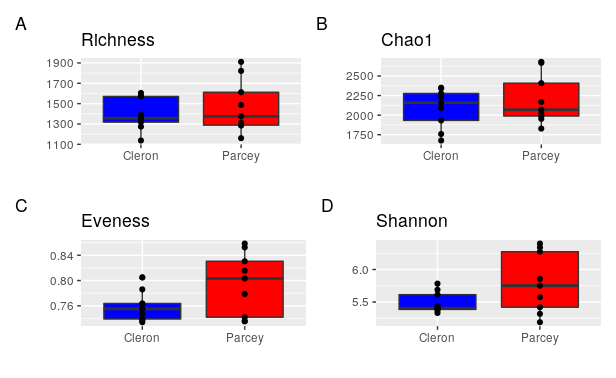
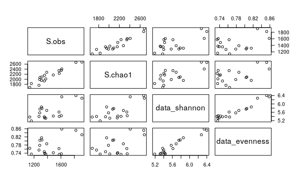

  
## Table of Contents  
1. [Definitions and important information](#1-definitions-and-important-information)
2. [Indices calculation](#2-indices-calculation)
3. [Visualization](#3-visualization)
4. [Statistical analyses](#4-statistical-analyses)
  
  
## 1. Definitions and important information   
Alpha-diversity represents diversity within an ecosystem or a sample, in other words, what is there and how much is there in term of species. However, it is not easy to define a species and we can calculate alpha-diversity at different taxonomic levels.  
In this tutorial, we are looking at the OTU level (clustered at 97% similarity thresholds).  
  
Several alpha-diversity indices can be calculated. Within the most commonly used:  
- Richness represents the number of species observed in each sample.  
- Chao1 estimates the total richness.  
- Pielou’s evenness provides information about the equity in species abundance in each sample, in other words are some species dominating others or do all species have quite the same abundances.  
- Shannon index provides information about both richness and evenness.  
  
  
> ## Remark 
> Alpha-diversity is calculated on the raw data, here `data_otu` or `data_phylo` if you are using phyloseq.  
It is important to not use filtered data because many richness estimates are modeled on singletons and doubletons in the occurrence table. So, you need to leave them in the dataset if you want a meaningful estimate.  
Moreover, we usually not using normalized data because we want to assess the diversity on the raw data and we are not comparing samples to each other but only assessing diversity within each sample.  
{: .callout}
  
~~~
# Run this if you don't have these objects into your R environment
data_otu <- read.table("data_loue_16S_nonnorm.txt", header = TRUE)
data_grp <- read.table("data_loue_16S_nonnorm_grp.txt", header = TRUE)
data_taxo <- read.table("data_loue_16S_nonnorm_taxo.txt", header = TRUE)

OTU = otu_table(as.matrix(data_otu), taxa_are_rows = FALSE)              
SAM = sample_data(data_grp, errorIfNULL = TRUE)                
TAX = tax_table(as.matrix(data_taxo)) 
data_phylo <- phyloseq(OTU, TAX, SAM) 
~~~
{: .language-r}
  
## 2. Indices calculation  

~~~
data_richness <- estimateR(data_otu)                                            # calculate richness and Chao1 using vegan package

data_evenness <- diversity(data_otu) / log(specnumber(data_otu))                # calculate evenness index using vegan package

data_shannon <- diversity(data_otu, index = "shannon")                          # calculate Shannon index using vegan package

data_alphadiv <- cbind(data_grp, t(data_richness), data_shannon, data_evenness) # combine all indices in one data table

rm(data_richness, data_evenness, data_shannon)                                  # remove the unnecessary data/vector
~~~
{: .language-r}

We used here the R package vegan in order to calculate the different alpha-diversity indices.  
  
Put the data in tidy format  
~~~
data_alphadiv_tidy <- 
  data_alphadiv %>%
  mutate(sample_id = rownames(data_alphadiv)) %>%
  gather(key   = alphadiv_index,
         value = obs_values,
         -sample_id, -site, -month, -site_month)

head(data_alphadiv_tidy)
~~~
{: .language-r}
  
~~~
  site    month    site_month    sample_id           alphadiv_index obs_values
1 Cleron   July   Cleron_July   Cleron_07_1          S.obs          1137
2 Cleron   July   Cleron_July   Cleron_07_2          S.obs          1274
3 Cleron   July   Cleron_July   Cleron_07_3          S.obs          1605
4 Cleron August   Cleron_August Cleron_08_1          S.obs          1575
5 Cleron August   Cleron_August Cleron_08_2          S.obs          1353
6 Cleron August   Cleron_August Cleron_08_3          S.obs          1357
~~~
{: .output}
  
## 3. Visualization  
  
Plot the four alpha-diversity indices for both sites.  
~~~
# Remark: For this part you need the R packages `ggplot2` and `patchwork`.  

P1 <- ggplot(data_alphadiv, aes(x=site, y=S.obs)) +
  geom_boxplot(fill=c("blue","red")) +
  labs(title= 'Richness', x= ' ', y= '', tag = "A") +
  geom_point()

P2 <- ggplot(data_alphadiv, aes(x=site, y=S.chao1)) +
  geom_boxplot(fill=c("blue","red")) +
  labs(title= 'Chao1', x= ' ', y= '', tag = "B") +
  geom_point()

P3 <- ggplot(data_alphadiv, aes(x=site, y=data_evenness)) +
  geom_boxplot(fill=c("blue","red")) +
  labs(title= 'Eveness', x= ' ', y= '', tag = "C") +
  geom_point()

P4 <- ggplot(data_alphadiv, aes(x=site, y=data_shannon)) +
  geom_boxplot(fill=c("blue","red")) +
  labs(title= 'Shannon', x= ' ', y= '', tag = "D") +
  geom_point()

# all plots together using the patchwork package
(P1 | P2) / (P3 | P4)
~~~
{: .language-r}

  
> ## Questions
> 1. How many OTU are observed in the two different sites? 
> 2. How do you interpret the difference between Richness and Chao1 plots? 
> 3. How do you interpret the Evenness and Shannon plots? Discuss intra- and inter-variability: are there big differences between samples belonging to the same treatment and between treatments. Are there big differences between these indices? Could you think how to check this?  
> 
> > ## Solutions
> > 1. For both sites, most of the samples have a richness between 1300 and 1600 OTUs.  
> > 2. The Chao1 has between 1900 and 2400 OTUs. Thus, Chao1 is higher in its richness, which suggests that the sequencing depth was not enough to catch all the diversity present in the harvested environment.  
> > 3. For the Evenness and the Shannon indices, the intra-variability between samples is lower for the samples harvested in Cleron than in Parcey. Evenness and Shannon are a bit lower in Cleron (*i.e.* around 0.75 and 5.5, respectively) than in Parcey (*i.e.* around 0.8 and 6.0, respectively) but doesn't seem to be significantly different. These two indices seems highly correlated. Remember that Shannon takes into account both richness and evenness.
> {: .solution}
{: .challenge}

Plot the four alpha-diversity indices for both sites.  
~~~
pairs(data_alphadiv[,c(4,5,9,10)])
~~~
{: .language-r}

~~~
cor(data_alphadiv[,c(4,5,9,10)])
~~~
{: .language-r}

~~~
                  S.obs   S.chao1 data_shannon data_evenness
S.obs         1.0000000 0.9434173    0.6752153     0.4452549
S.chao1       0.9434173 1.0000000    0.7187563     0.5176397
data_shannon  0.6752153 0.7187563    1.0000000     0.9609561
data_evenness 0.4452549 0.5176397    0.9609561     1.0000000
~~~
{: .output}
  
> ## Exercise
> Plot the samples according to their harvesting time point. Interpret the new plot as you did before for the sites.  
> 
> > ## Solution  
> > First plot.
> > ~~~~
> > P1 <- ggplot(data_alphadiv, aes(x = month, y = S.obs)) 
> >   + geom_boxplot(fill = c("black", "gray50", "gray80"))   
> >   + labs(title= "Richness", x = '', y = '', tag = "A")   
> >   + geom_point()
> > ~~~
> > {: .language-r}
> > 
> > Second plot.
> > ~~~
> > P2 <- ggplot(data_alphadiv, aes(x = month, y = S.chao1))
> >    + geom_boxplot(fill = c("black", "gray50", "gray80"))
> >    + labs(title = 'Chao1', x = ' ', y = '', tag = "B") 
> >    + geom_point()
> > ~~~
> > {: .language-r}
> > 
> > Third plot
> > ~~~
> > P3 <- ggplot(data_alphadiv, aes(x = month, y = data_evenness))   
> >    + geom_boxplot(fill = c("black", "gray50", "gray80")) 
> >    + labs(title= 'Eveness', x = ' ', y = '', tag = "C")  
> >    + geom_point()   
> > ~~~
> > {: .language-r}
> > 
> > Fourth plot
> > ~~~
> > P4 <- ggplot(data_alphadiv, aes(x = month, y = data_shannon)) 
> >    + geom_boxplot(fill = c("black", "gray50", "gray80"))    
> >    + labs(title = 'Shannon', x = ' ', y = '', tag = "D")    
> >    + geom_point()  
> > ~~~
> > {: .language-r}
> > 
> > The patchwork library is used here to arrange the plots.
> > ~~~
> > (P1 | P2) / (P3 | P4)
> > ~~~
> > {: .language-r}
> {: .solution}
{: .challenge}

  
We will now plot the samples according to their harvesting sites and time points at the same time.  
  
**Richness plot.**  
~~~
data_alphadiv_tidy %>%  
  filter(alphadiv_index == "S.obs") %>%  
  # fct_relevel() in forecats package to rearrange the sites and months as we want (chronologic)  
  mutate(month = fct_relevel(month, "July", "August", "September")) %>%  
  ggplot(., aes(x = month, y = obs_values)) +  
  geom_boxplot(aes(fill = month)) +  
  geom_point() +  
  facet_grid(. ~ site) +  
  labs(y = "Richness", x = "") +  
  # x axis label reoriented for better readability  
  theme(axis.text.x = element_text(angle = 45, hjust = 1))  
~~~
{: .language-r} 
  
> ## Exercise
> Plot the other three alpha-diversity indices and interpret the results.  
> 
> > ## Solution  
> > Chao1 plot.
> > ~~~~
> > data_alphadiv_tidy %>%  
> >   filter(alphadiv_index == "S.chao1") %>%  
> >   # fct_relevel() in forecats package to rearrange the sites and months as we want (chronologic)  
> >   mutate(month = fct_relevel(month, "July", "August", "September")) %>%  
> >   ggplot(., aes(x = month, y = obs_values)) +  
> >   geom_boxplot(aes(fill = month)) +  
> >   geom_point() +  
> >   facet_grid(. ~ site) +  
> >   labs(y = "Chao1", x = "") +  
> >   # x axis label reoriented for better readability  
> >   theme(axis.text.x = element_text(angle = 45, hjust = 1))  
> > ~~~
> > {: .language-r}
> > 
> > Evenness plot.
> > ~~~
> > data_alphadiv_tidy %>%  
> >   filter(alphadiv_index == "data_evenness") %>%  
> >   # fct_relevel() in forecats package to rearrange the sites and months as we want (chronologic)  
> >   mutate(month = fct_relevel(month, "July", "August", "September")) %>%  
> >   ggplot(., aes(x = month, y = obs_values)) +  
> >   geom_boxplot(aes(fill = month)) +  
> >   geom_point() +  
> >   facet_grid(. ~ site) +  
> >   labs(y = "Evenness", x = "") +  
> >   # x axis label reoriented for better readability  
> >   theme(axis.text.x = element_text(angle = 45, hjust = 1))  
> > ~~~
> > {: .language-r}
> > 
> > Shannon plot
> > ~~~
> > data_alphadiv_tidy %>%  
> >   filter(alphadiv_index == "data_shannon") %>%  
> >   # fct_relevel() in forecats package to rearrange the sites and months as we want (chronologic)  
> >   mutate(month = fct_relevel(month, "July", "August", "September")) %>%  
> >   ggplot(., aes(x = month, y = obs_values)) +  
> >   geom_boxplot(aes(fill = month)) +  
> >   geom_point() +  
> >   facet_grid(. ~ site) +  
> >   labs(y = "Shannon", x = "") +  
> >   # x axis label reoriented for better readability  
> >   theme(axis.text.x = element_text(angle = 45, hjust = 1))  
> > ~~~
> > {: .language-r}
> {: .solution}
{: .challenge}
  
  
> ## Question
> Do you think that there is any significant differences between the alpha-diversity of samples harvested in Cleron and Parcey? Between the three harvesting dates? Between each treatments? How could you test it?  
{: .discussion}
  
  
## 4. Statistical analyses  
  
You can use different statistical tests in order to test if there is any significant differences between treatments: parametric tests (t-test and ANOVA) or non-parametric tests (Mann-Whitney and Kruskal-Wallis). Before using parametric tests, you need to make sure that you can use them (*e.g.* normal distribution, homoscedasticity).    

In this tutorial, we will use parametric tests.  
  
We will first test the effect of the sampling site on the richness using one-factor ANOVA test.  
~~~
summary(aov(data_shannon ~ site, data = data_alphadiv))
~~~
{: .language-r}

~~~
            Df Sum Sq Mean Sq F value Pr(>F)  
site         1 0.4066  0.4066   3.442 0.0821 .
Residuals   16 1.8903  0.1181                 
---
Signif. codes:  0 ‘***’ 0.001 ‘**’ 0.01 ‘*’ 0.05 ‘.’ 0.1 ‘ ’ 1
~~~
{: .output}

And then the effect of the sampling date on the richness also with a one-factor ANOVA test. 
~~~
aov_test <- aov(data_shannon ~ month, data = data_alphadiv)  
summary(aov_test)  
~~~
{: .language-r}

~~~
            Df Sum Sq Mean Sq F value Pr(>F)  
month        2  0.885  0.4425   4.701  0.026 *
Residuals   15  1.412  0.0941                 
---
Signif. codes:  0 ‘***’ 0.001 ‘**’ 0.01 ‘*’ 0.05 ‘.’ 0.1 ‘ ’ 1
~~~
{: .output}
  
We can interpret the results as following:    
  - There is no significant effect of the sampling site: Pr(>F) = 0.0821 (P-value > 0.05)  
  - There is a significant effect of the sampling date: Pr(>F) = 0.026 (P-value < 0.05)  
  
Now, we know that that there is significant difference between the sampling dates but we don't know which sampling date is significantly different from the others. Indeed, if we had only two levels (such as for the sites), we could automatically say that date 1 is significantly different from date 2 but we have here three levels (*e.g.* July, August and September).  

In order to know what are the differences among the sampling dates, we can do a post-hoc test (such as Tukey test for the parametric version or Dunn test for the non-parametric version).  
  
We will thus do a Tukey Honest Significant Difference test to test differences among the sampling dates.  
~~~
# post-hoc test
hsd_test <- TukeyHSD(aov_test) # require the agricolae package  
hsd_res <- HSD.test(aov_test, "month", group=T)$groups  
hsd_res  
~~~
{: .language-r}   

~~~
          data_shannon groups
July          5.870813      a
September     5.710602     ab
August        5.341253      b
~~~
{: .output}
  
We can interpret the results as following:  
  - Samples harvested in July are significantly different from the samples harvested in August  
  - There is no significant difference between the samples harvested in July and in September   
  - There is no significant difference between the samples harvested in August and in September  
  
> ## Remark
> When we test the effect of the sampling date, the samples from the two sites are pooled together. Looking at the boxplot you did before (including sampling site and date information), you can clearly see that the samples harvested in Cleron in July and in September seems different, such as the samples harvested in Parcey. However, pooling both sites together makes them not different.  
In this case, you can suspect a significant effect of sampling date for a define site, of the sampling site for a define date, and an effect of the interaction between the sampling site and the sampling date. We should test the effects of the sampling site, the sampling date and their interaction in one test, such as a two-way ANOVA.  
{: .callout}
  
We will test the effect of the sampling site, the sampling date and their interaction on the richness using two-factor ANOVA tests.  
~~~
summary(aov(data_shannon ~ site * month, data = data_alphadiv))
~~~
{: .language-r}

~~~
            Df Sum Sq Mean Sq F value   Pr(>F)    
site         1 0.4066  0.4066   51.57 1.12e-05 ***
month        2 0.8850  0.4425   56.12 8.12e-07 ***
site:month   2 0.9107  0.4553   57.74 6.95e-07 ***
Residuals   12 0.0946  0.0079                     
---
Signif. codes:  0 ‘***’ 0.001 ‘**’ 0.01 ‘*’ 0.05 ‘.’ 0.1 ‘ ’ 1
~~~
{: .output}
  
We can see now that:  
  - There is a significant effect of the sampling site: Pr(>F) = 1.12e-05  (P-value < 0.05)  
  - There is a significant effect of the sampling date: Pr(>F) = 8.12e-07 (P-value < 0.05)  
  - There is a significant effect of the interaction: Pr(>F) = 6.95e-07  (P-value < 0.05)  
  
> ## Remark 
> The Tukey test can only handle 1 factor, so we cannot study the effect of the sampling site, the sampling time and its interaction using a Tukey test. If you want to put letters on you boxplot to differentiate the different sampling sites and dates, you could use the factor "site_month" but it will consider each treatment as an independent condition, while it is not (because it does recognise the different sites and months).  
{: .callout}
  

> ## Exercise
> Determine the letters that you should add to your boxplot showing Shannon for each sampling site and dates.  
> > ## Solution
> > ~~~
> > aov_test <- aov(data_shannon ~ site_month, data = data_alphadiv)   
> > hsd_test <- TukeyHSD(aov_test)
> > hsd_res <- HSD.test(aov_test, "site_month", group = TRUE)$groups  
> > hsd_res
> > ~~~
> > {: .language-r} 
> {: .solution}
{: .challenge}

> ## Exercise
>  Test the effect of the harvesting site, the harvesting date and their interactions for the others alpha-diversity indices. Do the post-hoc test when it is necessary and interpret the results.      
> > ## Solution
> {: .solution}
{: .challenge}
  
  
  
> ## Remark
> If you want to do a Kruskal-Wallis and a Dunn test, you can find the R code below.
> ~~~
> kruskal.test(data_shannon ~ site, data = data_alphadiv)
> kruskal.test(data_shannon ~ month, data = data_alphadiv)    
> PT <- dunnTest(data_shannon ~ month, data = data_alphadiv, method="bh") # require the FSA package     
> PT2 <- PT$res  
> cldList(comparison = PT2$Comparison, p.value = PT2$P.adj, threshold  = 0.05) # require the rcompanion package   
> ~~~
> {: .language-r} 
{: .callout}   
  
~~~
# Kruskal-Wallis
Kruskal-Wallis rank sum test
data:  data_shannon by month
Kruskal-Wallis chi-squared = 8.5029, df = 2, p-value = 0.01424

# Dunn test
      Group Letter MonoLetter
1    August      a         a 
2      July      b          b
3 September      b          b
~~~
{: .output
}
  
