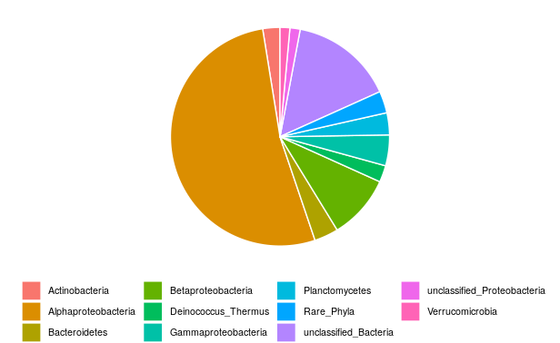
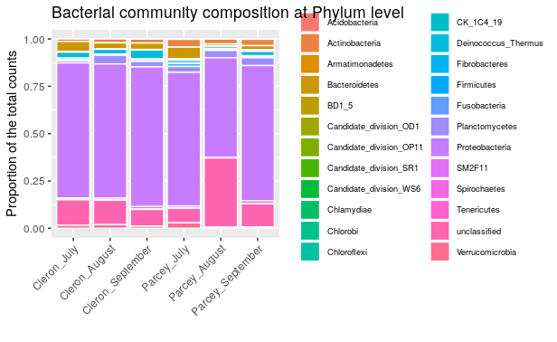

  
## Table of Contents  
- [1. Overview  ](#1-overview)
- [2. Data preparation  ](#2-data-preparation)
- [3. Global composition for all the samples using piechart  ](#3-global-composition-for-all-the-samples-using-piechart)
- [4. Global bacterial community composition for each treatment using barplot  ](#4-global-bacterial-community-composition-for-each-treatment-using-barplot)
  
  
## 1. Overview  
In this episode, you will find some very common visualizations which you will also frequently encounter in the literature are barplots, pie charts and boxplots. 
In this part of the tutorial, you will learn how to plot and interpret microbiome composition.   

  
> ## Remark 
> Bacterial community composition is analyzed on the filtered and normalized data: `data_otu_filt_rar` or the phyloseq object `data_phylo_filt_rar`. 
> In order, to be able to assign taxonomy to the different OTU, we will use both OTU table and taxonomy table (originally *data_taxo*).  
{: .callout}

 

> ## Remark 
> In the `phyloseq` package, you can find fonctions that allow you to rapidly represent the microbial composition (see for example https://joey711.github.io/phyloseq/plot_bar-examples.html).   
> However, in this tutorial, we will try to apply your R skills to filter and combine the data sets, and visualize the bacterial communities step by step.  
 {: .callout} 

~~~
# Run this if you don't have these objects into your R environment
library(vegan)
library(phyloseq)
library(tidyverse)

data_otu <- read.table("data_loue_16S_nonnorm.txt", header = TRUE)
data_grp <- read.table("data_loue_16S_nonnorm_grp.txt", header = TRUE)
data_taxo <- read.table("data_loue_16S_nonnorm_taxo.txt", header = TRUE)

OTU = otu_table(as.matrix(data_otu), taxa_are_rows = FALSE)              
SAM = sample_data(data_grp, errorIfNULL = TRUE)                
TAX = tax_table(as.matrix(data_taxo)) 
data_phylo <- phyloseq(OTU, TAX, SAM) 

set.seed(1782) # set seed for analysis reproducibility
data_phylo_filt = filter_taxa(data_phylo, function(x) sum(x > 2) > (0.11 * length(x)), TRUE) 
OTU_filt_rar = rarefy_even_depth(otu_table(data_phylo_filt), rngseed = TRUE, replace = FALSE) # rarefy the raw data using Phyloseq package
data_otu_filt_rar = data.frame(otu_table(OTU_filt_rar)) # create a separated file
~~~
{: .language-r}

  
## 2. Data preparation  
  
First, we will create a new data table including the taxonomic information for only the OTU that remain in the filtered and normalized OTU data table.  
~~~
data_taxo_filt_rar <- data_taxo[which(rownames(data_taxo) %in% colnames(data_otu_filt_rar)),]

data_taxo_filt_rar$OTU_id <- rownames(data_taxo_filt_rar) # add the rownames in a column in order to be able to use it later with dplyr

head(data_taxo_filt_rar)

dim(data_taxo) # all OTU = 5248

dim(data_otu_filt_rar) # after filt and norm nb of OTU = 1381

dim(data_taxo_filt_rar) # chech dimensions, we have now 1381 OTUs
~~~
{: .language-r}
  
Then, we will create a new data table including the grouping factors and the OTU occurrences.  
~~~
data_grp_temp <- data_grp

data_grp_temp$sample_id <- rownames(data_grp_temp) # to be able to use the column later with dplyr

data_otu_filt_rar_temp <- data_otu_filt_rar

data_otu_filt_rar_temp$sample_id <- rownames(data_otu_filt_rar_temp) # to be able to use the column later with dplyr

data_otu_grp_filt_rar <- inner_join(data_grp_temp, data_otu_filt_rar_temp, by = "sample_id")

rm(data_grp_temp, data_otu_filt_rar_temp)

data_otu_grp_filt_rar[1:5, 1:7]
~~~
{: .language-r}

~~~
    site  month    site_month   sample_id OTU_00009 OTU_00020 OTU_00084
1 Cleron   July   Cleron_July Cleron_07_1         0         0         6
2 Cleron   July   Cleron_July Cleron_07_2         0         0         9
3 Cleron   July   Cleron_July Cleron_07_3         0         0        29
4 Cleron August Cleron_August Cleron_08_1         0         0        22
5 Cleron August Cleron_August Cleron_08_2         0         0        58
~~~
{: .output
}
  
Finally, we will aggregate the new data table, `data_otu_grp_filt_rar`, by treatment and add the aggregated data table to the data table that include taxonomic information, `data_taxo_filt_rar`.  
~~~
# Calculate sum of counts per treatment
data_otu_filt_rar_site_month <- aggregate(data_otu_grp_filt_rar[, 5:1385], by = list(site_month=data_otu_grp_filt_rar$site_month), sum)
data_otu_filt_rar_site_month[, 1:7]
dim(data_otu_filt_rar_site_month)
~~~
{: .language-r}

~~~
6 1382
~~~
{: .output}

~~~
# Transpose the data table, calculate & add total_count for all samples, and add a column with OTU_id
data_otu_filt_rar_site_month_temp <- as.data.frame(t(as.matrix(data_otu_filt_rar_site_month[,2:dim(data_otu_filt_rar_site_month)[2]])))
colnames(data_otu_filt_rar_site_month_temp) <- data_otu_filt_rar_site_month[,1]
data_otu_filt_rar_site_month_temp$total_counts <- rowSums(data_otu_filt_rar_site_month_temp)
data_otu_filt_rar_site_month_temp$OTU_id <- rownames(data_otu_filt_rar_site_month_temp)

head(data_otu_filt_rar_site_month_temp)
~~~
{: .language-r}

~~~
          Cleron_August Cleron_July Cleron_September Parcey_August Parcey_July Parcey_September total_counts    OTU_id
OTU_00009             0           0                1             5           1                2            9 OTU_00009
OTU_00020             0           0                0            33           0                8           41 OTU_00020
OTU_00084            94          44               69            65          53               53          378 OTU_00084
OTU_00195            27          64               40             7          87               10          235 OTU_00195
OTU_00248             0           0                0            47           0                8           55 OTU_00248
OTU_00320             2           3                2             1           2                1           11 OTU_00320
~~~
{: .output}

~~~
# Transpose the full OTU data table, data_otu_filt_rar
data_otu_filt_rar_t <- as.data.frame(t(as.matrix(data_otu_filt_rar)))
data_otu_filt_rar_t$OTU_id <- rownames(data_otu_filt_rar_t)
~~~~
{: .language-r}

~~~
# Combine the two OTU tables, the aggregated OTU table (data_otu_filt_rar_site_month_temp) with data_otu_filt_rar_t
data_otu_filt_rar_temp <- inner_join(data_otu_filt_rar_site_month_temp, data_otu_filt_rar_t, by = "OTU_id")

rm(data_otu_filt_rar_t,data_otu_filt_rar_site_month_temp)

data_otu_filt_rar_temp[1:5, 1:5]
~~~
{: .language-r}

~~~
  Cleron_August Cleron_July Cleron_September Parcey_August Parcey_July
1             0           0                1             5           1
2             0           0                0            33           0
3            94          44               69            65          53
4            27          64               40             7          87
5             0           0                0            47           0
~~~
{: .output}

~~~
# Combine the taxonomic table, data_taxo_filt_rar, with the new OTU table, data_otu_filt_rar_temp
data_otu_taxo_filt_rar <- inner_join(data_taxo_filt_rar, data_otu_filt_rar_temp, by = "OTU_id")

dim(data_otu_taxo_filt_rar)
rm(data_otu_filt_rar_temp)

data_otu_taxo_filt_rar[1:5, 1:5]
~~~
{: .language-r}

~~~
       LCA_simplified   Domain         Phylum               Class            Order
1      Planctomycetes Bacteria Planctomycetes    Planctomycetacia Planctomycetales
2 Alphaproteobacteria Bacteria Proteobacteria Alphaproteobacteria      Rhizobiales
3      Planctomycetes Bacteria Planctomycetes    Planctomycetacia Planctomycetales
4  Betaproteobacteria Bacteria Proteobacteria  Betaproteobacteria     unclassified
5 Alphaproteobacteria Bacteria Proteobacteria Alphaproteobacteria      Rhizobiales
~~~
{: .output}
  
## 3. Global composition for all the samples using piechart  
  
We will visualize here the global bacterial composition in the Loue River without taking into account the different treatments. 
We already calculated the sum for all the samples for each OTU (see the [data preparation section](#data-preparation)). 
We will then pool the OTU that belong to the same Phylum or Class. Indeed, usually, we first describe the global community at the highest taxonomic level, here the Phylum level (except for the Proteobacteria, which are described at Class level).  
  
> ## Remark 
> To avoid having a lot a rare phyla and adding noise in the plot, we often combine all rare Phyla (abundance < 1%) in one group (here called "Rare_Phyla").  
{: .callout}
  
We will sum all the OTU that belonging to the same Phylum (or Class for Proteobacteria) and visualize the data using a pie chart.  
~~~
# Filter abundant Phyla
abundant_com <- data_otu_taxo_filt_rar %>%
  select(LCA_simplified, total_counts) %>%
  group_by(LCA_simplified) %>%
  summarize(total_counts_per_phylum = sum(total_counts)) %>%
  ungroup() %>%
  mutate(total_counts_percentage = total_counts_per_phylum / sum(total_counts_per_phylum) * 100) %>%
  filter(total_counts_percentage >= 1) %>%
  select(LCA_simplified, total_counts_percentage)

# Compile rare Phyla
# Data table global communities simplified
rare_com <- data_frame(LCA_simplified=c("Rare_Phyla"),total_counts_percentage=100-sum(abundant_com$total_counts_percentage))
global_com <- bind_rows(abundant_com,rare_com)

# Piechart
ggplot(global_com, aes(x="", y=total_counts_percentage, fill=LCA_simplified)) +
  geom_bar(stat="identity", width=1, color="white") +
  coord_polar("y", start=0) +
  theme_void() +
  theme(legend.title=element_blank(), legend.position="bottom", legend.text = element_text(size = 8))
~~~
{: .language-r} 

  
  
You can see that the bacterial community within epilithic biofilms from the Loue River in France is dominated by Proteobacteria, 
representing 68% of the total bacterial community. 
Within the Proteobacteria, 77% of the reads were identified as Alphaproteobacteria.  
  
  
## 4. Global bacterial community composition for each treatment using barplot  
  
We will visualize here the global bacterial composition in the Loue River for each treatment. We already calculated for each OTU the sum of counts for all the samples that belong to a same treatment. We will then pool the OTU that belong to the same Phylum.  
  
We will sum all the OTU that belonging to the same Phylum and visualize the data using a barplot.  
~~~
# Sum per Phyla
com_per_treatment_phylum_temp <- aggregate(data_otu_taxo_filt_rar[, 10:15], by=list(Phylum=data_otu_taxo_filt_rar$Phylum), sum)

# Tidying the data set
com_per_treatment_phylum <- com_per_treatment_phylum_temp %>%
  gather(key   = treatment, value = obs_values,-Phylum)

# Barplot
com_per_treatment_phylum %>%
  mutate(treatment = fct_relevel(treatment, "Cleron_July", "Cleron_August", "Cleron_September", "Parcey_July", "Parcey_August", "Parcey_September")) %>%
  ggplot(., aes(x = treatment, y = obs_values, fill = Phylum)) +
  geom_bar(position = "fill", stat = "identity", width = 0.9, color = "white") +
  theme(legend.title = element_blank(), legend.text = element_text(size = 7)) +
  theme(axis.text.x = element_text(angle = 45, hjust = 1)) +
  labs(title= 'Bacterial community composition at Phylum level', x= '', y= 'Proportion of the total counts')
~~~
{: .language-r} 

  
We can observe that in August at Parcey, it seems to have more unclassified bacteria. Moreover, we can observe more Bacteroidetes and Verrucomicrobia when the water is colder at Cleron and in July in Parcey. Finally, we can also observed more Deinococcus-Thermus at Cleron than at Parcey and in September and less Acidobacteria at Cleron than at Parcey.  
  
> ## Exercise
> We usually also represent Proteobacteria at Class level. Please plot the Proteobacteria community for each treatment and interpret the plot.  
> > ## Solution
> > ~~~
> > # Filter only Proteobacteria
> > com_per_treatment_class_temp <- data_otu_taxo_filt_rar %>%
> >   filter(Phylum == "Proteobacteria")
> > 
> > # Sum per Class
> > com_per_treatment_class_temp <- aggregate(com_per_treatment_class_temp[, 10:15], by=list(Class = com_per_treatment_class_temp$Class), sum)
> > 
> > # Tidying the data set
> > com_per_treatment_class <- com_per_treatment_class_temp %>%
> >   gather(key = treatment, value = obs_values, -Class)
> > 
> > # Barplot
> > com_per_treatment_class %>%
> >   mutate(treatment = fct_relevel(treatment, "Cleron_July", "Cleron_August", "Cleron_September", "Parcey_July", "Parcey_August", "Parcey_September")) %>%
> >   ggplot(., aes(x=treatment, y=obs_values, fill=Class)) +
> >   geom_bar(position="fill", stat="identity", width=0.9, color="white") +
> >   theme(legend.title=element_blank(), legend.text = element_text(size = 7)) +
> >   theme(axis.text.x = element_text(angle = 45, hjust = 1)) +
> >   labs(title= 'Proteobacteria', x= '', y= 'Proportion of the total counts')
> > ~~~
> > {: .language-r}
> {: .solution}
{: .challenge}  
  
