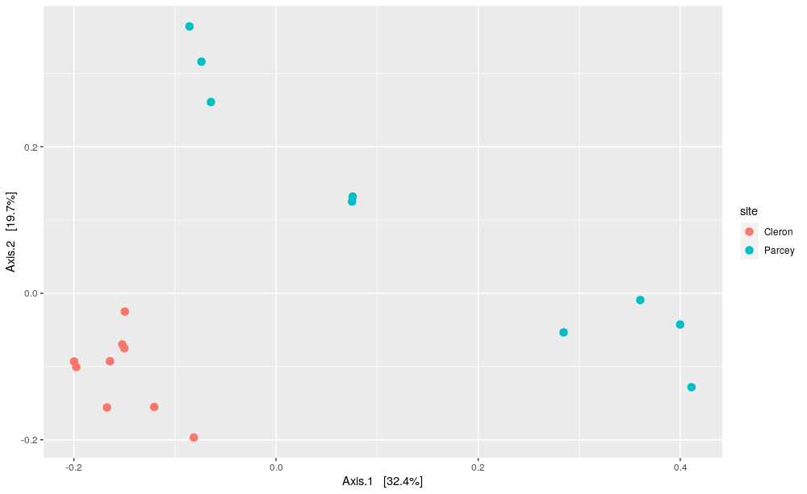
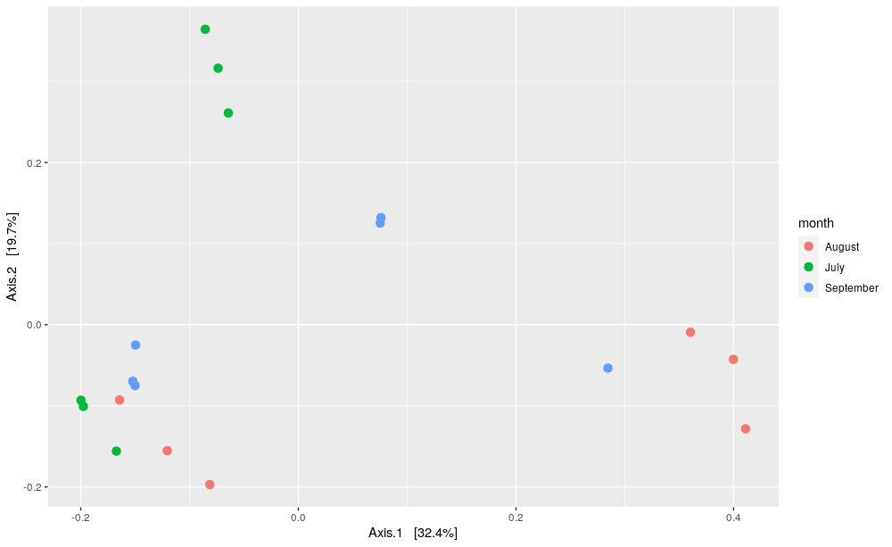

    
## Table of Contents  
- [1. Definitions and important information  ](#1-definitions-and-important-information)
- [2. Distances calculation  ](#2-distances-calculation)
- [3. Visualisation using PCOA ordination plot  ](#3-visualisation-using-pcoa-ordination-plot)
- [4. Statistical test  ](#4-statistical-test)
  
  
## 1. Definitions and important information   
While alpha-diversity represents the diversity within an ecosystem or a sample, beta-diversity represents the difference between two ecosystems/samples. In other word, how similar or different are two ecosystems or samples? So, beta-diversity is a distance between two samples. Microbial ecologists do not use Euclidean distances but usually use Bray-Curtis, Jaccard or weight/unweight Unifrac distances to estimate the betadiversity.    

The _Bray-Curtis_ dissimilarity is based on occurrence data (abundance), while the _Jaccard_ distance is based on presence/absence data (does not include abundance information). UniFrac distances take into account the occurrence table and the phylogeny diversity (sequence distance). Weighted or unweighted UniFrac distances depending if taking into account relative abundance or only presence/absence.  
Distances metrics are between 0 and 1: 0 means identical communities in both samples and 1 means different communities in both samples.  
  
> ## Remark  
> Beta-diversity is calculated on filtered and normalized data tables: the `data_otu_filt_rar` data table or the phyloseq object `data_phylo_filt_rar`.  
{: .callout} 

~~~
# Load the required packages
library(vegan)
library(phyloseq)
library(tidyverse)
library(patchwork)
library(agricolae)
library(FSA)
library(rcompanion)

# Run this if you don't have these objects into your R environment
data_otu <- read.table("data_loue_16S_nonnorm.txt", header = TRUE)
data_grp <- read.table("data_loue_16S_nonnorm_grp.txt", header=TRUE, stringsAsFactors = TRUE)
data_taxo <- read.table("data_loue_16S_nonnorm_taxo.txt", header = TRUE)

OTU = otu_table(as.matrix(data_otu), taxa_are_rows = FALSE)              
SAM = sample_data(data_grp, errorIfNULL = TRUE)                
TAX = tax_table(as.matrix(data_taxo)) 
data_phylo <- phyloseq(OTU, TAX, SAM) 

data_phylo_filt = filter_taxa(data_phylo, function(x) sum(x > 2) > (0.11 * length(x)), TRUE) 
set.seed(1782) # set seed for analysis reproducibility
OTU_filt_rar = rarefy_even_depth(otu_table(data_phylo_filt), rngseed = TRUE, replace = FALSE) # rarefy the raw data using Phyloseq package
data_otu_filt_rar = data.frame(otu_table(OTU_filt_rar)) # create a separated file
data_phylo_filt_rar <- phyloseq(OTU_filt_rar, TAX, SAM) # create a phyloseq object
~~~
{: .language-r}

> ## Question 
> Why would Bray-Curtis or Unifrac distances be better for microbiota data than the Euclidean distance?  
> > ## Solution 
> > Microbiota data are sparse and specific distances, such as Bray-Curtis, Jaccard or weight/unweight Unifrac distances, better deal with the problem of the presence of many double zeros in data sets.  
> {: .solution}
{: .challenge}
  
> ## Remark
> We cannot calculate UniFrac distances here because we don't have the phylogenic distances.  
{: .callout}  
  
## 2. Distances calculation  
~~~
# calculate Bray-Curtis distance using the vegan package
dist_bc <- as.matrix(vegdist(data_otu_filt_rar, method = "bray")) 

# a peek at the first five rows / columns
dist_bc[1:5, 1:5]
~~~
{: .language-r}

~~~
            Cleron_07_1 Cleron_07_2 Cleron_07_3 Cleron_08_1 Cleron_08_2
Cleron_07_1   0.0000000   0.2127742   0.3145806   0.5833548   0.4350968
Cleron_07_2   0.2127742   0.0000000   0.2658065   0.5541935   0.4016774
Cleron_07_3   0.3145806   0.2658065   0.0000000   0.4581935   0.3468387
Cleron_08_1   0.5833548   0.5541935   0.4581935   0.0000000   0.3304516
Cleron_08_2   0.4350968   0.4016774   0.3468387   0.3304516   0.0000000
~~~
{: .output}  
  
## 3. Visualisation using PCOA ordination plot  
In order to represent in a two dimensional plot from the huge inter-sample distances matrix (pairwise distances), we are doing a principal coordinate analysis (PCoA). Principal Component Analysis (PCA) is a special case of PCoA for which Euclidean distances are calculated between samples. However, PCoA works with any dissimilarity measure (such as Bray-Curtis, Jaccard or weight/unweight Unifrac distances) and so specific association coefficients that better deal with the problem of the presence of many double zeros in data sets can be surmounted.  
However, PCoA does not provide a direct link between the components and the original variables and so the interpretation of variable contribution may be more difficult. This is because PCoA components, instead of being linear combinations of the original variables as in PCA, are complex functions of the original variables depending on the selected dissimilarity measure.  
  
PCoA based on Bray-Curtis distances for the two different sites:  
~~~
# calculate PCOA using Phyloseq package
pcoa_bc = ordinate(data_phylo_filt_rar, "PCoA", "bray") 

plot_ordination(data_phylo_filt_rar, pcoa_bc, color = "site") + 
  geom_point(size = 3) 
~~~
{: .language-r}

  
> ## Question 
> How do you interpret this plot? What can you say about total variance explained by this ordination? 
> What can you say about intra- and inter-variability among the two groups?  
> > ## Solution 
> > The PCOA plot represents every samples as a dot, which is colored according to their sampling site (Cleron in red and Parcey in blue). 
> > First, this two-dimensions PCOA plot show 42% of the total variance between the samples.   
> Then, we can see that on both first and second axis, we can differenciate samples harvested in Cleron and in Parcey.   
> > Finally, we can see that the intra-variability between the samples harvested in Cleron is much lower than the intra-variability between the samples harvested in 
> > Parcey. However, we can still observe two distinct groups for the samples harvested in the two sites, so the intra-variability within a site in lower than the 
> > inter-varibility between sites.  
> {: .solution}
{: .challenge}
  
> ## Exercise
> Represent, now the samples according to their sampling dates. Interpret the corresponding plots.  
>
> > ## Solution
> > ~~~
> > # plot PCOA using Phyloseq package
> > plot_ordination(data_phylo_filt_rar, pcoa_bc, color = "month") + 
> >   geom_point(size = 3)
> > ~~~
> > {: .language-r}
> > 
> > 
> > 
> > The PCOA plot represents every samples as a dot, which is colored according to their sampling date (July in green, August in red and September in blue). First, this two-dimensional PCOA plot show 42% of the total variance between the samples. Then, we cannot clearly differentiate the sample harvested in the different dates neither on the first nor on the second axis. Indeed, the intra-variability between the samples harvested in July, August or September is similar to the inter-varibility between the months.  
> > 
> {: .solution}
{: .challenge}

> ## Exercise
> If you have more than one factor, such as in this example, it is better to represent all the different treatments. Represent, now the samples according to their sampling sites and dates. Interpret the corresponding plots.  
>
> > ## Solution
> > ~~~
> > # plot PCOA using Phyloseq package
> > plot_ordination(data_phylo_filt_rar, pcoa_bc, color = "site", shape ="month") + 
> >   geom_point(size = 3)
> > ~~~
> > {: .language-r}
> > 
> > The PCOA plot represents every samples as a dot, which is colored according to their sampling site and date.  
> > First, this two-dimensions PCOA plot show 42% of the total variance between the samples.  
> > Then, we can see that on both first and second axis, we can differenciate samples harvested in Cleron and in Parcey.  
> > We can also differenciate samples harvested in Parcey in July, August and September on both first and second axis.  
> > For the samples harvested in Cleron, we can only differenciate samples harvested in August and September on the second axis, which represent 20% of the total variance.  
> > Finally, we can see that the intra-variability between the samples harvested in Cleron is much lower than the intra-variability between the samples harvested in Parcey. This can be explained by the lowest difference among the three sampling dates in Cleron than for Parcey.  
> > So, we can clearly observe difference between the two sampling sites and differences among the three sampling dates, especially for samples harvested in Parcey.  
> > 
> {: .solution}
{: .challenge}

  
## 4. Statistical test  
  
To test whether the groups are different with respect to centroid and dispersion, a _PERMANOVA_ statistical test will be performed. For this a multivariate extension of ANOVA will be used, as there are many OTU that will be used in the test. The extension is based on distances between samples. The test compares distances of samples within the same group to distances of samples from different groups. If the distance between samples from the different groups is much larger than samples from the same group, we conclude that the groups are not equal.   

In order to test the significance of the result, a permutation test is used. Thus all samples are randomly mixed over the groups and the test is repeated many times. If the ratio (between group distance / within group distance) is much larger for the original data than for the permutations, we conclude there is a statistical significant difference.    

The test can be applied in combination with any distance measure. Here we use the Bray-Curtis distance as was also used for the PCoA above.  
  
First, we will test if there is any significant effect of the sampling site.  
~~~
# Permanova test using the vegan package
adonis(data_otu_filt_rar~site,data=data_grp, permutations=9999, method="bray")
~~~
{: .language-r}

~~~
Call:
adonis(formula = distance(data_phylo_filt_rar, method = "bray") ~      site, data = metadata) 

Permutation: free
Number of permutations: 999

Terms added sequentially (first to last)

          Df SumsOfSqs MeanSqs F.Model      R2 Pr(>F)    
site       1   0.63649 0.63649  5.6298 0.26028  0.001 ***
Residuals 16   1.80892 0.11306         0.73972           
Total     17   2.44542                 1.00000           
---
Signif. codes:  0 ‘***’ 0.001 ‘**’ 0.01 ‘*’ 0.05 ‘.’ 0.1 ‘ ’ 1
~~~
{: .output}
  
The Total Sum of Squares is obtained from summing up all squared distances and dividing this by the number of samples - 1. The Residuals sum of squares (or within group sum of squares) is obtained by adding all squared distances of samples in the same group and divide this by the number of samples per group. The site sum of squares (or between group sum of squares) = SSTotal - SSResiduals. The F.model value then is obtained by the ratio of the Mean Squares (which are the Sum of squares divided by their degrees of freedom). The fraction of permuted results that provide a higher F value than the original data Pr(>F) represents the p-value which is significant when < 0.05.  
  
> ## Question
> What is your conclusion regarding the Permanova test result? What can you say about intra- and inter-variability among the two groups? 
> 
> > ## Solution
> > The P-value is inferior to 0.05 (Pr(>F) = 1e-04), so we can conclude that the intra-variability is lower than the inter-variability among the two sites and that we have a significant effect of the sampling site. 
> {: .solution}
{: .challenge} 
  
> ## Question
> Test the effect of the sampling site, the sampling date and their interaction on the bacterial community beta-diversity and interpret the results obtained.  
> 
> > ## Solution
> > ~~~
> > adonis(data_otu_filt_rar~site * month,data=data_grp, permutations=9999, method="bray")
> > ~~~
> > {: .language-r}
> > 
> > The P-value is inferior to 0.05 for the effect of the site, the month and the interaction. Thus, we can conclude that the intra-variability is lower than the
> > inter-variability among the different treatments and that we have a significant effect of the sampling site, the sampling date and their interaction.
> {: .solution}
{: .challenge}
